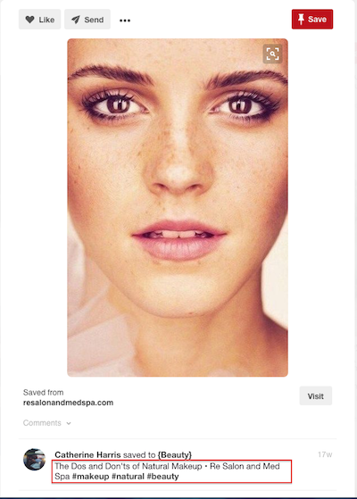
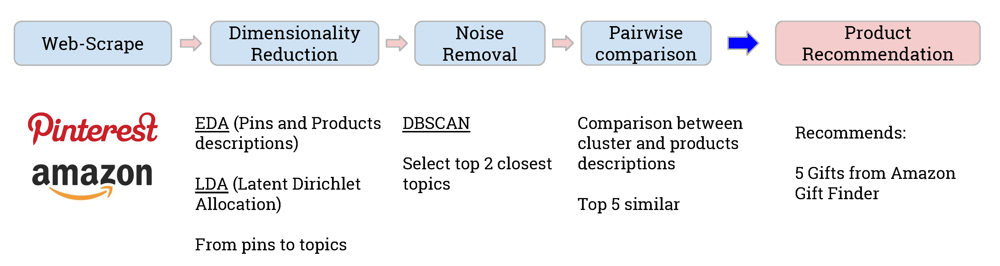
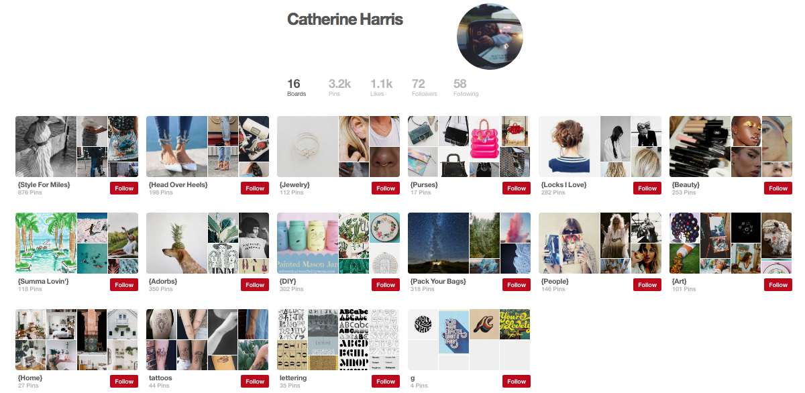
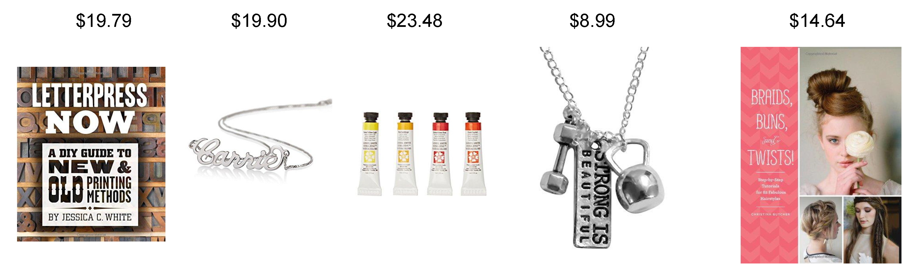

# GiftHit - A gift recommender based on Pinterest profiles

This project was built in 2 weeks at the final stage of the Galvanize Data Science Immersive program.

## Motivation

Every year at the holiday season, we always find the same problem over and over again: What should I give to my cousin? How many times we find ourselves having no idea what to get someone for their birthday?

A great gift (Gift hit) is the one where you show that you know who the person is and what he/she is about.

The idea of this project is to recommend a gift based on people's Pinterest pins. Pinterest is an application that allows us to save pins we like by topic.
By knowing the personal taste of each user of Pinterest we can then recommend something that this person has a high interest on. Based on Amazon's gift Finder section the app will then recommend a gift that he/she will have a high probability to like.

The work will be presented by a web application in a near future.

## Data

### Pinterest Profiles

In order to obtain user information and their pins, I scrape Pinterest usernames first by extracting random usernames and after their followers names. I extract a total of 50000 users with respective pins information.
The pins descriptions are obtained by an RSS feed: https://www.pinterest.com/username/feed.rss.  

### Products

The products for the recommendation system were scraped from Amazon.com Gift Finder Section. Department information, title of the product, price and product images and descriptions are obtained. A total of 7863 products were collected.

### Methodology

After obtaining the data from web-scraping, I applied Natural Language Processing (NLP) techniques and Latent Dirichlet Allocation (LDA) in order to perform topic modeling. This process allowed to reduce the dimensions of the problem by going from text based pins into topics. Based on the topic modeling we apply Density Based Spatial Clustering Application with Noise (DBSCAN) in order to remove the outlier topics and focus on the closest topics. From these two topics we perform a pairwise comparison with the products descriptions and recommend the top 5 products that are more similar to the topics selected.

### Example

In this example we set the two required inputs from the user:
Maximum price: $30
Pinterest username of whom we want to give a present to: catherineann03

Looking at Catherine profile we can observe what she likes:

The recommendation system recommends 5 products bellow the price limit ($30):

### Future Work

In the future I would like to:

- Integrate the code into a Web Application;
- Implement user-user similarity in the model;
- Add more users to the database in order to improve the model;
- Add more products to the database in order to improve the recommendations.

### Acknowledges

- Moses Marsh, Dan Wiesenthal for the guidance and support
- Colleagues from SF-DSI cohort 17 and 18 for all the feedback and fruitful discussions  

#### References:

[1] Bird, Steven, Edward Loper and Ewan Klein (2009), Natural Language Processing with Python. O’Reilly Media Inc.

#### Tools used:
 Python( BeautifulSoup , Selenium, Feedparser, Numpy, Pandas, Scikit-Learn, Nltk, gensim, Flask), Amazon Web Services(Amazon EC2), Amazon.com and Pinterest API.
